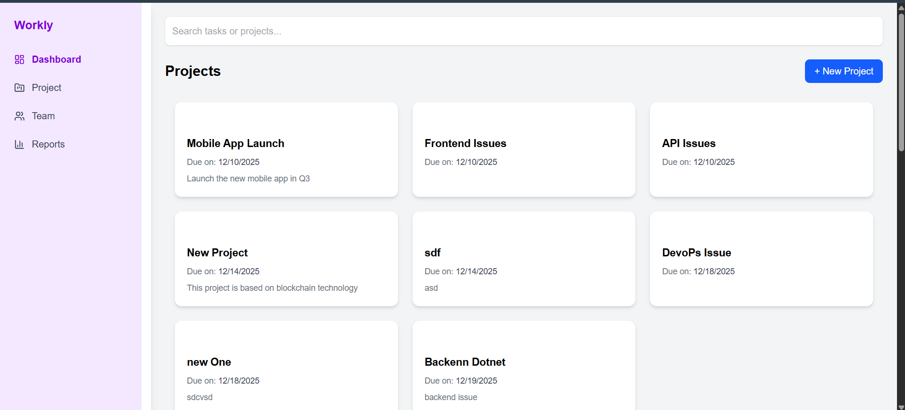
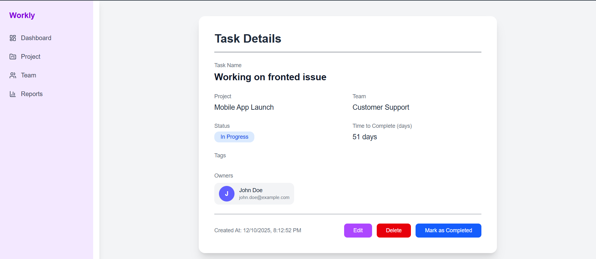
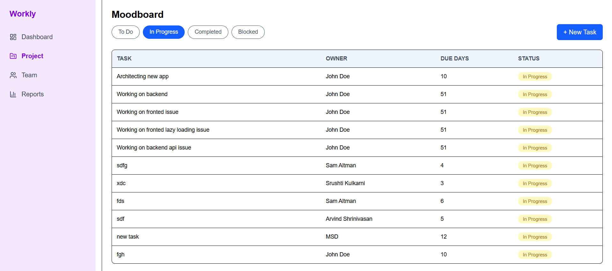
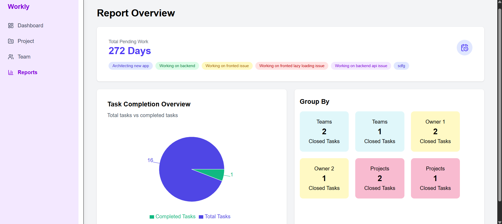

# 🗂️ Task Management Frontend

A modern task management web application (frontend) built with **React + Vite**. This project provides a clean UI to view, create, update, and delete tasks from your task management system.

## 🌟 Features

- 📋 View a list of tasks
- ➕ Add new tasks
- ✏️ Edit existing tasks
- ❌ Remove tasks
- 🎨 Clean & responsive UI

> *This frontend is designed to be paired with a backend API (if available) for full CRUD functionality.*

---

## 🚀 Demo

Live Demo: https://workly-git-main-srushti-kulkarnis-projects.vercel.app/








---

## 📌 Table of Contents

- [Prerequisites](#-prerequisites)
- [Installation](#-installation)
- [Usage](#-usage)
- [Project Structure](#-project-structure)
- [Tech Stack](#-tech-stack)
- [Contributing](#-contributing)
- [License](#-license)
- [Author](#-author)

---

## 🛠️ Prerequisites

Make sure you have the following installed:

- 🧠 Node.js (v14 or higher)
- 📦 npm or Yarn

---

## 💻 Installation

1. **Clone the project**
   ```
   git clone https://github.com/Srushtik942/Task_management_Frontend.git
   ```


2. **Navigate into the directory**
   ```
   cd Task_management_Frontend

   ```
3. **Install dependencies**

   ```
   npm install
   # or
   yarn

   ```

▶️ Usage

To run the development server:
```
npm run start

```

📁 Project Structure

```

Task_management_Frontend/
├── public/                     # Static assets
├── src/
│   ├── components/             # Reusable UI components
│   ├── pages/                  # Page-level components
│   ├── App.jsx                 # Root application component
│   ├── main.jsx                # App entry point
├── .env                        # Environment variables
├── vite.config.js              # Vite configuration
├── package.json
└── README.md


```

